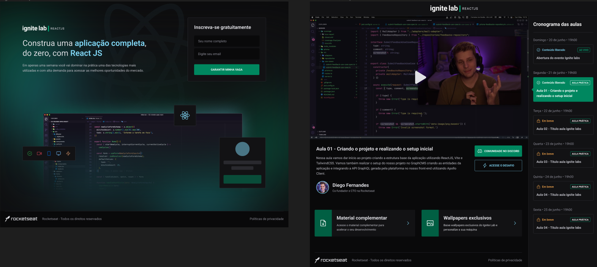

 <h1>Ignite Lab - Rocketseat 🚀</h1>
 <h2>Plataforma de Eventos<h2>

---

## 💻 Sobre o projeto

Esta é uma plataforma para visualização de aulas online. A base da aplicação foi criada utilizando ReactJS, Vite e TailwindCSS. Foi utilizado GraphCMS para a criação das entidades da aplicação e integração da API GraphQL gerada pela plataforma no nosso front-end utilizando Apollo Client.

💻 [Acesse a aplicação](https://event-platform-ignitelab-ck8yhcmhy-annebortoli.vercel.app/)

:art: [Figma da aplicação](<https://www.figma.com/file/mwjsqzn3C0VZsjn7rvxXUA/Plataforma-de-evento---Ignite-Lab-(Community)?node-id=0%3A1>)

---

## 🛠️ Tecnologias utilizadas

---

## 👩‍💻 Desenvolvedora:

<table>
    <tr align="center">
        <td style="background-color: #8257e6;">
            
        </td>
    </tr>
    <tr align="center" style="background-color: #8257e6;">
        <td>
        <a href="https://github.com/ANNEBORTOLI" target="_blank" style="text-decoration: none; color: #ffffff;">Anne Bortoli</a>
        </td>
    </tr>
</table>
